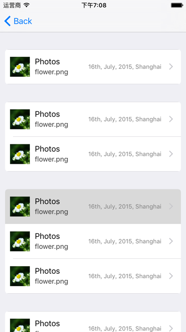
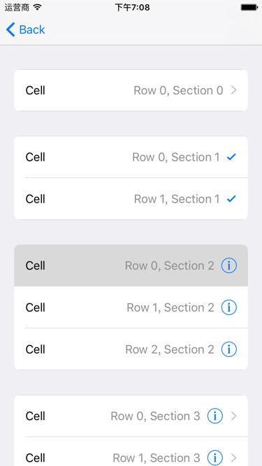

#CardStyleTableView
An extension of UITableView and UITableViewCell which displays a card style view in grouped tableView, similar to the system's tableView before iOS 7.






##How To Get Started
###Carthage
Specify "CardStyleTableView" in your ```Cartfile```:
```ogdl 
github "teambition/CardStyleTableView"
```

###Usage
#####  Import CardStyleTableView
```swift
import CardStyleTableView
```

##### Assign delegate
```swift
tableView.cardStyleSource = self
```

#####  CardStyleTableViewStyleSource
```swift
func roundingCornersForCard(inSection section: Int) -> UIRectCorner {
    // set rounding corners of this section, default is UIRectCorner.AllCorners
}

func leftPaddingForCardStyleTableView() -> CGFloat {
    // leftPadding
}

func rightPaddingForCardStyleTableView() -> CGFloat {
    // rightPadding
}

func cornerRadiusForCardStyleTableView() -> CGFloat {
    // cornerRadius
}
```

## Minimum Requirement
iOS 8.0

## Release Notes
* [Release Notes](https://github.com/teambition/CardStyleTableView/releases)

## License
CardStyleTableView is released under the MIT license. See [LICENSE](https://github.com/teambition/CardStyleTableView/blob/master/LICENSE.md) for details.

## More Info
Have a question? Please [open an issue](https://github.com/teambition/CardStyleTableView/issues/new)!
